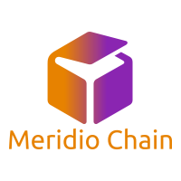
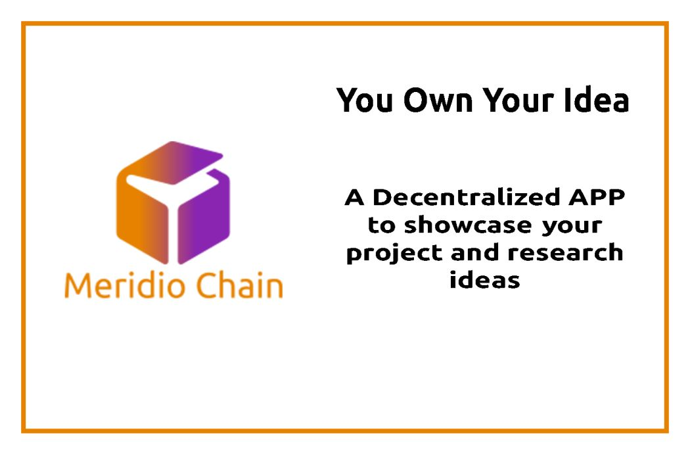
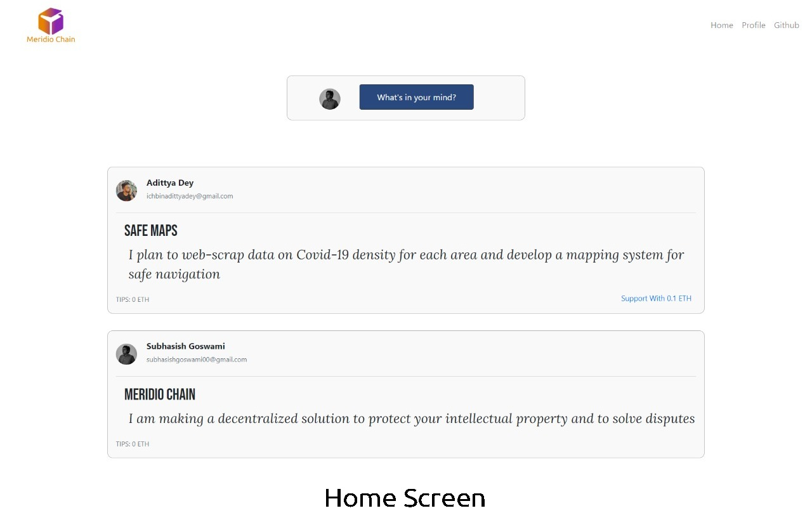

  

<h3 align="center">You own your idea!</h3>
 

### Problem Statement
We love making new projects and working on new ideas. During the current scenario of online classes what we miss the most is the constant support of our teachers and professors. Imagine having a noble idea which you can't find on the internet but after working for so long on your idea, you  find that someone has already worked on the idea and published his work in a foreign language journal.
Even after you implement your idea, patenting something in India takes 4 to 6 years. Moreover the process is long enough to make it impossible for new ones to complete without any support.
There needs to be a platform where one can share their research and project idea so that others can check if someone is working on idea before they can start. The platform needs to store data in an immutable manner so that if there is any day some issue regarding ownership of the intelectual property records can be checked to ensure who came up the idea first.

### How we plan to solve the problem
We present to you Meridio Chain. Meridio means 'To Share' in greek and as the name suggests we present a platform to share, to share your ideas.
We propose a solution based on Ethereum Blockchain to post project and research ideas by the users. Ideas will be stored in the Ethereum Blockchain network in order to maintain immutability. Data will be stored on the Ethereum blockchain by smart contracts written in Solidity through transactions. User’s unique ethereum address is fetched using Web3js and it is used as an unique key to retrieve complete profile details from MongoDB database. Apart from checking if someone is already working on a project idea, users can also support other projects by sending Ethereum to the author’s ethereum address. Under the Profile section, users can check their profile details and also previous posts made by them.
Using our solution, the users can look if someone is already working on their idea and if not they can post their idea. Users can support other projects or even contact authors of various projects.

### Screenies

 
 

### Technologies used

##### Distributed App 

* ReactJS
* Solidity
* Web3JS
* Truffle

##### Server App - [Visit the repository](https://github.com/subhasishgosw5/Meridio-Chain-Backend)

* Flask
* MongoDB

### Installing depencencies and running the app
* Do `npm install` (One Time Setup)
* Do `npm install -g ganache-cli` and then `npm install -g truffle` (One Time Setup)
* Run `ganache-cli`
* In another terminal window, from project root run `truffle migrate`
* Make sure your MetaMask in connected to localhost:8545
* Finally, Run WebApp with `npm run start`

 

### Authors

##### [Adittya Dey](https://github.com/adiXcodr)
##### [Subhasish Goswami](https://github.com/subhasishgosw5)
##### [Aavishkar Mishra](https://github.com/aavishkarmishra)
##### [Rabijit Singh](https://github.com/rabijitsingh)
 

